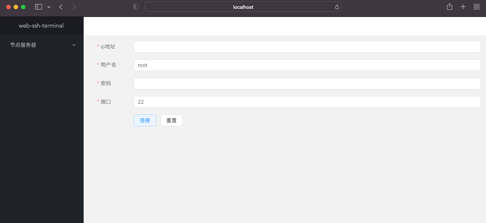
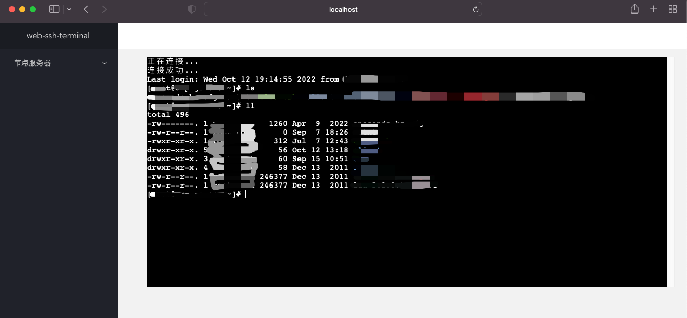

# websshterminal-vue

<a href="https://github.com/jeffcail/websshterminal-vue/releases">
    
  </a>
   <a href="https://github.com/jeffcail/websshterminal-vue/blob/master/LICENSE">
    
  </a>

## Project setup
```
npm install
```

### Compiles and hot-reloads for development
```
npm run serve
```

### Compiles and minifies for production
```
npm run build
```

### 效果展示
添加服务器



模拟终端

